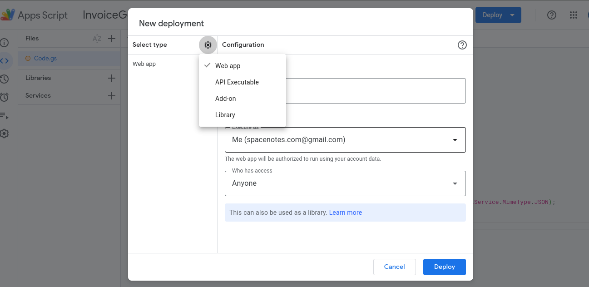
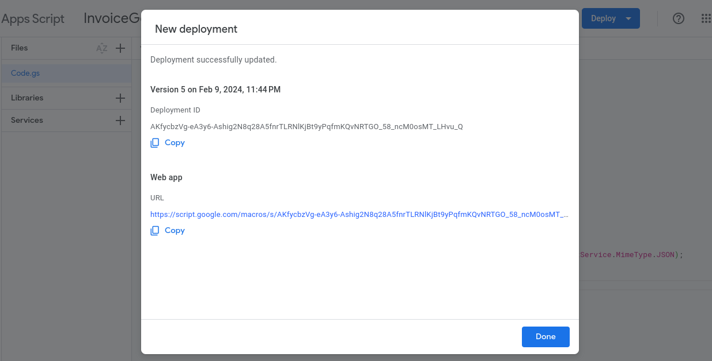

# Invoice Generator

## Project Features
1. Get Data as a JSON response from Google sheets
2. Generate new PDF's from response data such as invoices or anything you want with your personal template
3. Send Email to each user with there generated PDF via SMTP Server

## Google sheet as a API
- Getting JSON response
- First row as a key and others as a value
- Follow below steps to make google sheets as a API

### steps
1. Create a New Google worksheet with your google accoount
2. Rename Sheet1 as you want
3. Fill the data in the sheet as first row as a heading and others as a values
4. In `Extension` open `App Script` 
5. Name the `App Script` as the same name as your `worksheet`
6. Copy paste the below code in `Code.gs` file

```javascript
function doGet(req){
  var sheetName = 'Your sheet name';
  var doc = SpreadsheetApp.getActiveSpreadsheet();
  var sheet = doc.getSheetByName(sheetName);
  var values = sheet.getDataRange().getValues();

  var output = [];

  var keys = values[0];
  var data = values.slice(1);
  data.forEach((item) => {
    var row = {};
    keys.forEach((key, index) => {
      row[key] = item[index];
    })
    output.push(row);
  })
  console.log(output);
  return ContentService.createTextOutput(JSON.stringify({data: output})).setMimeType(ContentService.MimeType.JSON);
}
```
7. Deploy the following code as a `New Deployment` as a `web app`
8. Allow `Who can access` as `Anyone`
9. Copy the `script link` and `run` in `browser's address bar`

#### Deployment page

#### Script link page

